# ClimaBeats

ClimaBeats is an iOS application that combines real-time weather context with mood-based music playback and collaborative social listening rooms.

Users can sign up/login, fetch local weather, get weather-aligned playlists, play songs with rich controls, save favorites, import local songs, and create or join real-time room sessions.

## Table of Contents

- [Overview](#overview)
- [Core Features](#core-features)
- [Architecture](#architecture)
- [Weather to Mood Logic](#weather-to-mood-logic)
- [Social Rooms Workflow](#social-rooms-workflow)
- [Data Model and Storage](#data-model-and-storage)
- [Project Structure](#project-structure)
- [Screenshots](#screenshots)
- [Setup and Run](#setup-and-run)
- [Firebase Configuration Notes](#firebase-configuration-notes)
- [Troubleshooting](#troubleshooting)
- [Roadmap](#roadmap)
- [Team](#team)
- [License](#license)

## Overview

ClimaBeats personalizes listening experience using weather conditions and supports social interaction through room-based queue collaboration.

Primary flow:

1. User authenticates.
2. App fetches weather from current location (with Bangladesh fallback).
3. Weather condition maps to mood category.
4. Playlist loads from Firestore custom mode playlist or local defaults.
5. User can play tracks, manage favorites/library, or enter Social Rooms.

## Core Features

### Authentication and Session

- Sign Up and Login with Firebase Authentication
- Auto-login from landing screen when valid session exists
- Logout and safe return to landing flow

### Weather-Aware Experience

- Current location weather retrieval using CoreLocation + CLGeocoder
- Bangladesh fallback if permission is denied or location is outside configured region logic
- Condition, temperature, wind, humidity, and updated time display

### Playlist and Player

- Weather-to-mood playlist selection
- Custom mode playlist persistence in Firestore
- Reset to default playlist by mode
- Player controls: play/pause, next/back, seek, volume, shuffle, repeat

### Favorites and Local Library

- Add/remove favorites from player
- Firestore-backed favorite list
- Import local audio files from Files app and play them in-app

### Social Rooms

- Create and join rooms via room code
- My Room quick access
- Real-time members, suggestions, and queue updates
- Presence heartbeat and room lifecycle handling (active, ended, expired)

## Architecture

The project uses a layered feature architecture with UIKit + SwiftUI hybrid screens.

- UI Layer: UIKit view controllers plus SwiftUI host views
- ViewModel Layer: business orchestration for each screen
- Application Layer: room use cases (lifecycle, observation, interaction)
- Data Layer: Firestore repositories and realtime sync services
- Domain Layer: room models, protocols, and domain errors

Pattern summary:

- Standard app screens use ViewController + ViewModel
- Rooms feature uses UseCase + Repository + Protocol-driven modular structure
- Async operations rely on callbacks and Firestore listeners

## Weather to Mood Logic

Condition mapping used by playlist mode resolver:

- Energetic: sunny, clear
- Chill: partly cloudy, cloudy, overcast
- Intense: thunder, heavy rain
- Melancholic: rain, drizzle, sleet
- Cozy: snow, blizzard, ice, freezing
- Mysterious: fog, mist, haze
- Default fallback: chill

## Social Rooms Workflow

1. User opens Rooms from Home.
2. User chooses Create or Join.
3. On success, app starts room presence heartbeat.
4. Session view observes room, members, queue, and suggestions in real time.
5. Users suggest songs from current playlist.
6. Queue item playback updates shared room playback state.
7. On leave/end, membership and presence state are updated.

## Data Model and Storage

### Cloud Firestore

- users/{uid}
  - profile fields (name/email/uid)
  - favorites subcollection
  - modePlaylists subcollection
- rooms/{roomId}
  - room metadata and playback state
  - members subcollection
  - queue subcollection
  - suggestions subcollection
  - skipVotes subcollection

### Local Storage

- UserDefaults for cached current playlist and imported library metadata
- App documents directory for imported audio files

## Project Structure

```text
ClimaBeats/
  ClimaBeats/
    ClimaBeats.swift
    Features/
      Rooms/
        Application/
        Data/
        Domain/
        Navigation/
        Presentation/
    Helpers/
    Model/
    View/
    ViewModel/
  ClimaBeats.xcodeproj/
  firestore.rules
  firestore.indexes.json
  report.md
```

## Screenshots

### Authentication

<p align="center">
  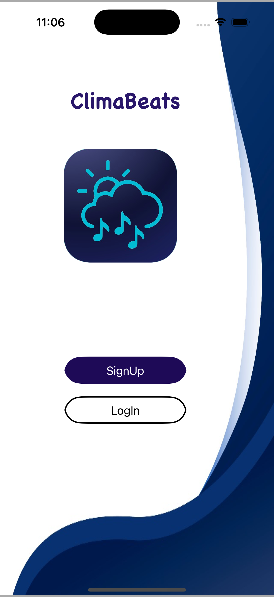
  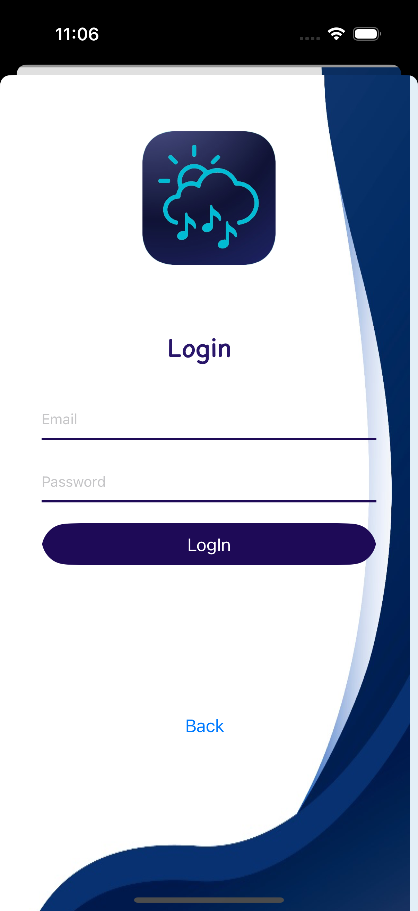
  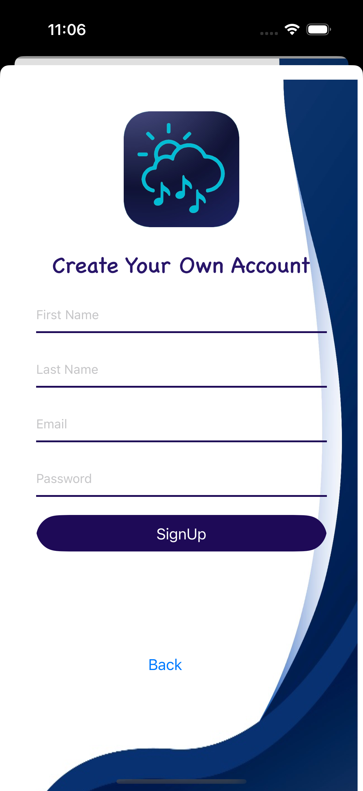
</p>

### Weather and Mood Playlist

<p align="center">
  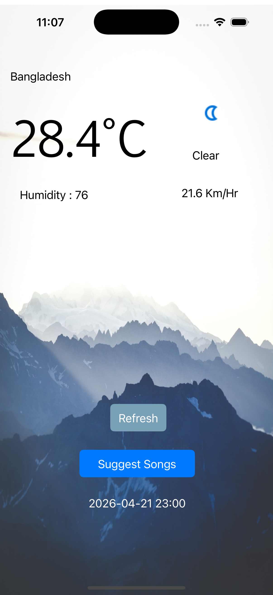
  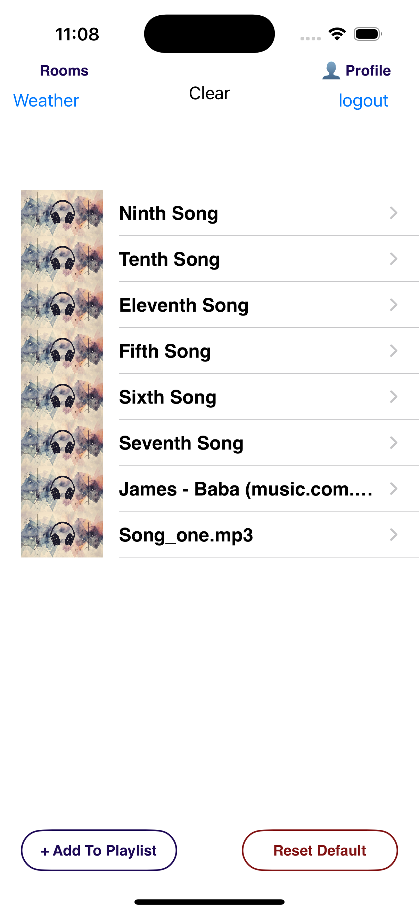
</p>

### Player, Favorites, Library

<p align="center">
  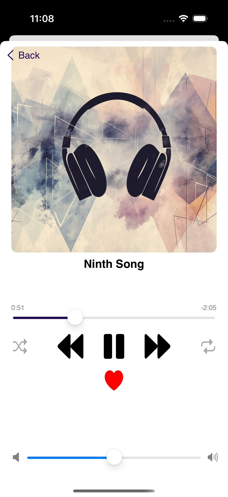
  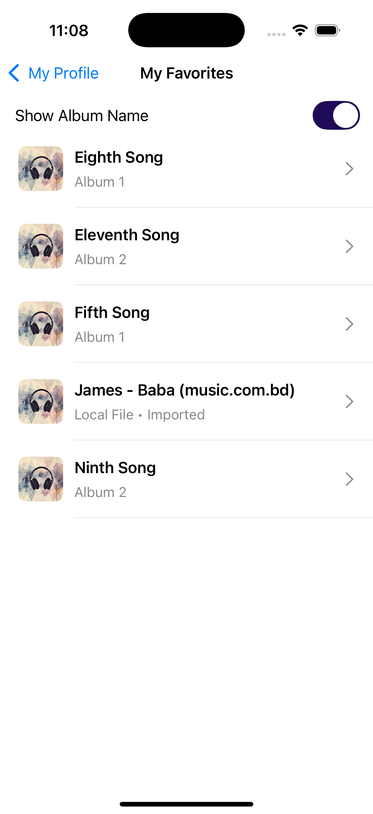
  
</p>

### Profile and Social Rooms

<p align="center">
  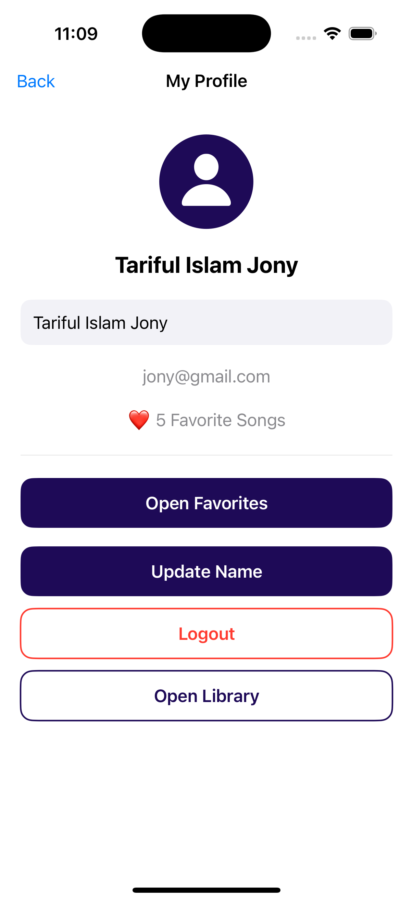
  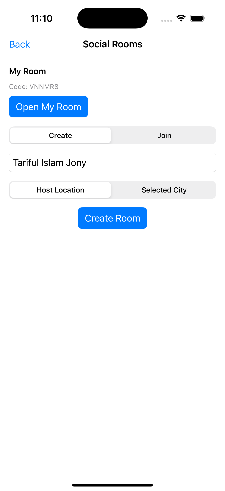
  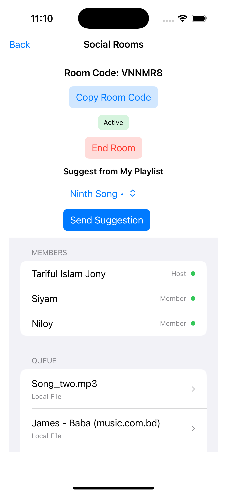
</p>

### Activity Diagrams

<p align="center">
  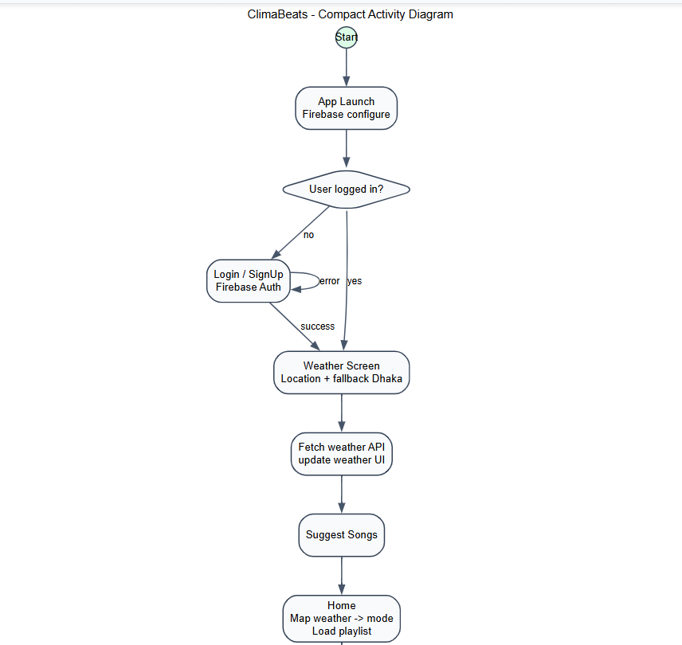
</p>

<p align="center">
  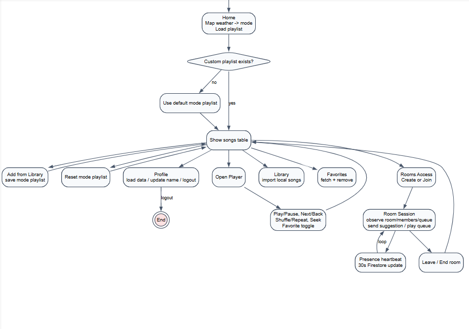
</p>

## Setup and Run

### Prerequisites

- macOS with latest stable Xcode
- iOS Simulator or physical iOS device
- Firebase project configured for iOS app bundle ID

### Steps

1. Open `ClimaBeats/ClimaBeats.xcodeproj` in Xcode.
2. Confirm `GoogleService-Info.plist` is included in the app target.
3. Check signing team and bundle identifier.
4. Select `ClimaBeats` scheme.
5. Build and run.

## Firebase Configuration Notes

- Authentication methods: Email/Password must be enabled.
- Firestore must be initialized and rules deployed.
- Use included rule/index files as baseline:
  - `ClimaBeats/firestore.rules`
  - `ClimaBeats/firestore.indexes.json`

## Troubleshooting

- App launches but auth fails:
  - Verify Firebase plist target membership and bundle ID match.
- Weather fetch fails:
  - Check network access and API key validity.
  - Confirm location permission in simulator/device settings.
- Room updates not appearing:
  - Verify Firestore rules and index deployment.
  - Confirm users are authenticated and room status is active.
- Imported songs not playing:
  - Ensure selected files are valid audio formats and import completed.

## Roadmap

- Smarter recommendation engine beyond keyword mapping
- Better queue moderation controls in Social Rooms
- Rich analytics and listening insights
- Expanded test coverage (unit + UI + integration)

## Team

- Niloy Chowdhury
- Md. Tariful Islam Jony
- Siyam Khan

## License

This project is intended for academic and learning purposes.
